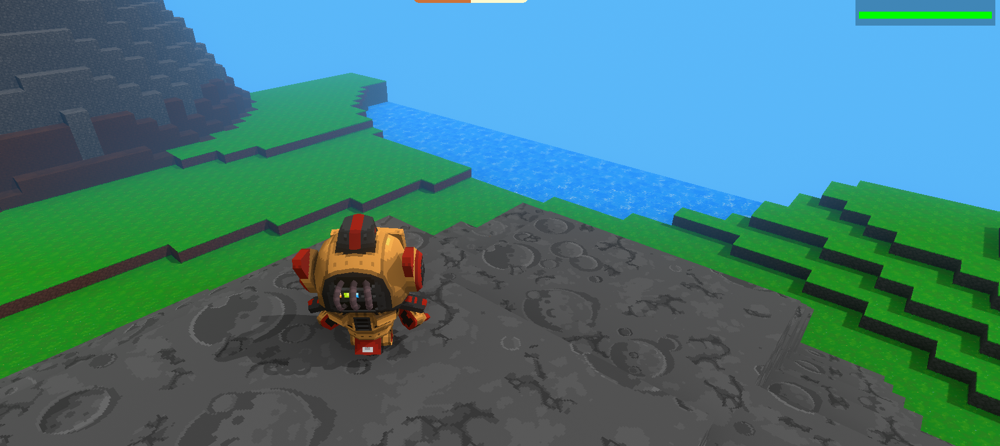
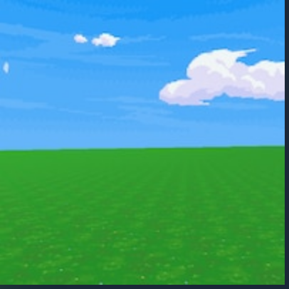
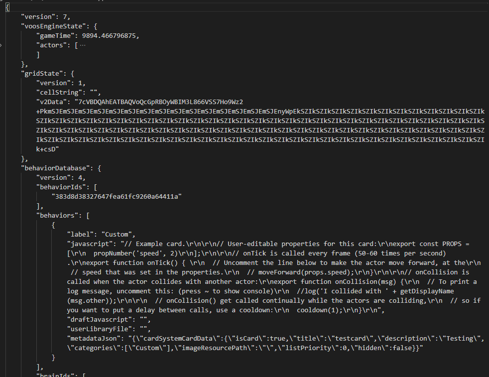
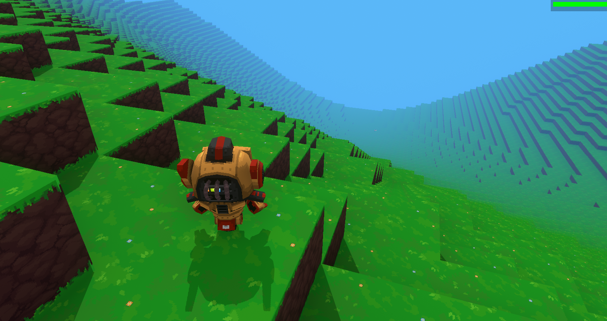
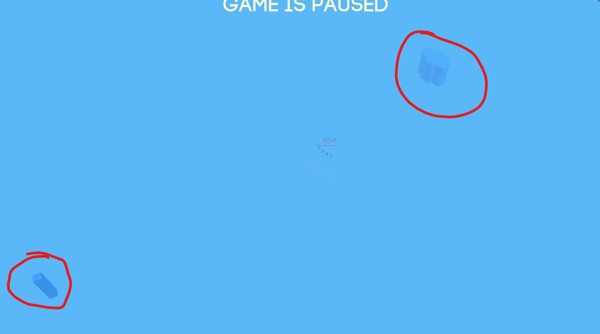
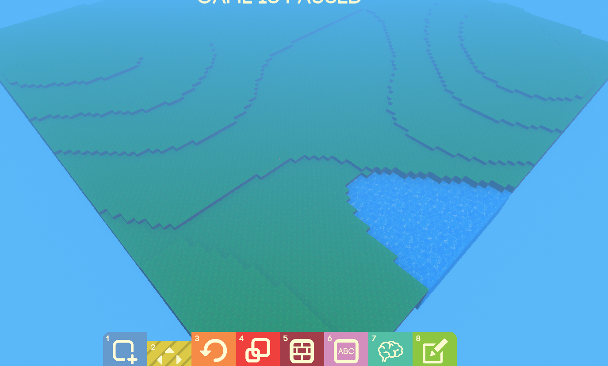
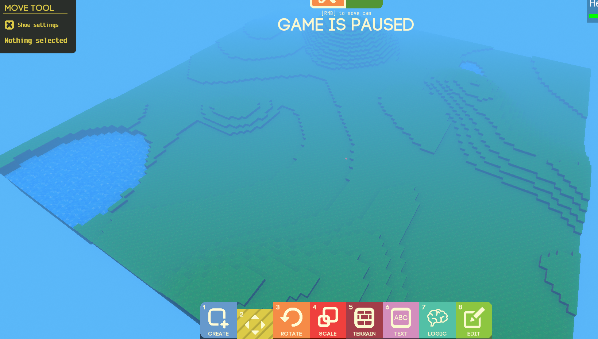
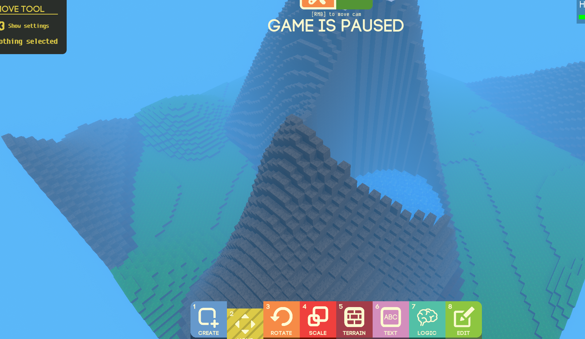
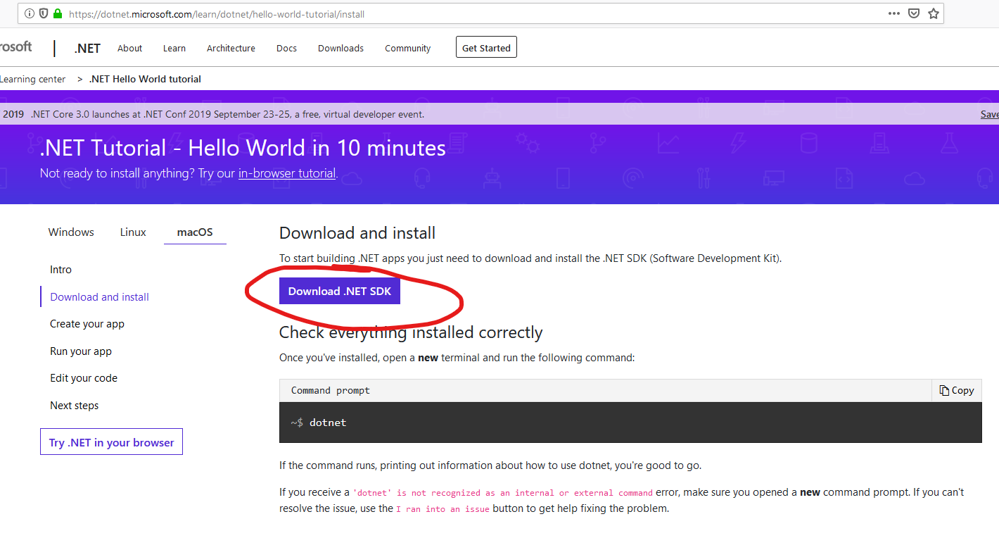

# GameBuilder world gen

## Table of contents
- [Who am I?](#introduction)
- [Internals, how it all works](#internals)
    - [The pre-work](#prework)
    - [Algorithms](#algorithms)
    - [Realistic terrain](#realistic-terrain)
    - [Bringing it together](#bringing-it-together)
- [Installation](#installation)
- [Using the tool](#usingit)

## Introduction
Hello! I go by Romans 8:28 in the Game Builder Discord and Steam forums, and I wanted to build upon the wonderful foundations that is Game Builder. 

There is so much we can already do in Game Builder, and the foundation continues to get laid as we are still in Early Access - but what I felt was lacking in the game is _terrain_. 

We have customizable characters and sounds and particles and a lot of freedom to really extend the game but our terrain looks like this.

That's a little upsetting, well at least it was to me. Of course nothing on the developers who have put a lot of extra time into developing this game, but I wanted to give this terrain a little extra _zing_ to give it some life. This is where the idea being these world gen tools came into being.

## The pre-work

We can thank @steverock (Developer) for introducing the `simpleData` format in order for this world gen tool to be possible. The complete details can be found on a link on the <a href="https://orangy.github.io/gamebuilder-plus/index.html">website</a>, but I will briefly explain the timeline here.

In order to create worlds that Game Builder can load, it is necessary that we understand what format the game's maps are saved as. For Game Builder, the format of maps are `.voos` files, which is a made-up format specifically designed for Game Builder. A `.voos` file is really just a JSON object containing information about the entire map (_everything_ in the map). If you happen to look at a `.voos` file, you will see a lot of information - perhaps too much to handle! 

Within this `.voos` file is a key named **v2Data** which aptly stands for version 2 of the encoded map data. (Version 2 is the latest versioning as of this writing; the version may go up in the future.) When a new world is generated, the terrain data gets compressed and serialized to the string that's saved in **v2Data** in the `.voos` file.

If we could understand how the **v2Data** terrain data is encoded, we would be able to reverse-engineer code that would allow us to create our own `.voos` files with custom terrain. Sounds easy enough, right? (It was not).

I did my best looking around at the code and was making some progress, but the approach I was taking was going to be brittle in that if the Game Builder team changed terrain generation in any way, I'd have to re-write all of my code. It wasn't the ideal solution, so I asked the team and what we came up with was `simpleData`. 

The way `simpleData` works is that if a map contains `simpleData` when that map is loaded, the game will deserialize the data and create the terrain (as described). In more laymans-terms, this means we have all of our map data in `simpleData`, all the positions (x, y, z) and Blocks we want to place, and the game will unravel this for us and place the Blocks as we have told it to do.

More detail about `simpleData` can be found in the link above shared by Steve. Later on, I will go over my implementation of the world gen tool in code which will give you the implementation I wrote and will provide additional information to _hopefully_ answer any and all questions you may have.

## Algorithms

The crux of world generation is an algorithm. What code or set of instructions can I tell a program to create for me a dynamic and natural looking world?

This question is a very hard one to ask, as there are lots of discussions around it and many different algorithms and combinations of algorithms to choose. When searching for an algorithm to use in the tool, I initially found the Diamond Square algorithm, but did not like the lack of variation I was finding when using it. I later found the Perlin Noise algorithm which I will briefly explain before going into how it is used in the world gen tool.

### Perlin Noise algorithm
Perlin Noise is actually not an algorithm, but rather a function (it takes in inputs and returns an output) that returns a value within a given range. Depending on the implementation, the output value of Perlin Noise is from 0 to 1 [0, 1] or -1 to 1 [-1, 1].

To use Perlin Noise in terrain generation, and how I used it, is to put your x and y values into the function and save the output. The value of your output is the height of the terrain block that you will place in the map.

In a simple example, if we are generating the height of a terrain block at (x=2, z=3), we would put these inputs into the Perlin Noise function, and save the result into y.

`y = PerlinNoise(x, z)`

If the result of the above function is 7, we would use these results to generate a Block at (x=2, y=7, z=3). The idea is that you would iterate over every x and z value in a map and get back a value for y. If we create a world _just_ with Perlin Noise, this is the kind of map we get back.

Which is _fine_. Don't get me wrong, this is a fine map. This is essentially the [first dynamic map](https://steamcommunity.com/sharedfiles/filedetails/?id=1848201246) that I made on the Steam workshop, but it wasn't really what I wanted. I wanted more flat lands and more steep hills, and a more dynamic way of styling the blocks instead of using a heightmap.

## Making more realistic terrain

We obviously can't use the Perlin Noise algorithm as-is, it produces too curved hills that don't work well for flat structures or steep mountains. To modify the algorithm, we apply some _math tricks_ (mostly taken from <a href="https://www.redblobgames.com/maps/terrain-from-noise/">here</a>) in order to shape the result in the way we want. For flater plains, we simply clamp the result of Perlin Noise to return values only between 0-4. For mountains, we take the result of Perlin Noise _octave_ and raise it to an exponent (to creater sharper cliffs). For lakes, we only take the x-lowest y-values of the Perlin Noise result to get a unique lake shape. 

If you are more curious, you can take a peek in the source code to see what I did. Most of the values are customizable through the tool so you aren't constrained to the sizes of these features in your maps if you want something different.

## Bringing it together

Let me preface this and say this did not come to me immediately. In fact, this was over the course of many iterations that I figured out a process that worked well. The process the Game Builder world gen tool makes use of is **layering**.

Here's what the tool does.

It first makes lakes, if specified.

Then, it makes the plains.

Then the hills are next, if specified.

Last, mountains are created, if specified.

Of course, in this process, blocks are colored based on the map's biome and constraints are placed on the blocks so we only are generating terrain within the limits of the game (-20 to 130).

## Installation / usage

Go and download the .NET SDK <a href="https://dotnet.microsoft.com/learn/dotnet/hello-world-tutorial/install">from this page</a>. 

then...

### Windows users
Go and download the <a href="https://github.com/orangy/gamebuilder-plus/tree/master/tools/worldgen/Releases">Releases</a> folder for your system: win-x64 (most likely), win-x86 or win-arm and download the **entire** folder to your computer. Double-click on the .exe to run the application.

### Linux/OSX users
Go and download the <a href="https://github.com/orangy/gamebuilder-plus/tree/master/tools/worldgen/Releases">Releases</a> folder for your system and download the **entire** folder to your computer. Open up a terminal/console window in this folder containing the downloadable files. Run the following command to start the application:

#### v1
`dotnet .\GBWorldGen.Main.dll`

#### v2
`dotnet .\GBWorldGen.Main.dll`

## Using the tool